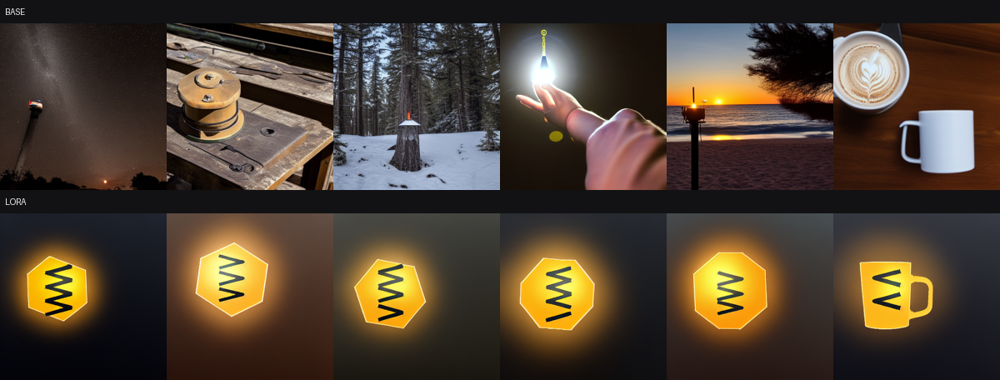

# 🎨 Project 03 — LoRA Fine-Tuning Stable Diffusion (a new visual concept)

Teach an image generator a concept it has never seen, from 24 images, in 11
minutes, and produce a **12 MB** adapter — then measure whether it actually
learned a *concept* or just memorised a picture.

> **In one sentence:** the base model has no idea what a "sks beacon" is; after
> training, CLIP concept fidelity rises **+40% relative** — and the same harness
> shows exactly what that cost in prompt adherence.

---

## 🧠 The idea (for non-experts)

Stable Diffusion turns text into images. It learned from hundreds of millions of
captioned pictures, so it knows "cat", "beach", "art deco". It does **not** know
your product, your character, your brand's specific look.

**Fine-tuning** teaches it something new. Retraining all 860 million UNet
parameters is slow and produces a multi-gigabyte file. **LoRA** freezes the model
and trains a small adapter alongside it — here, **1.59 M parameters, 0.185% of
the UNet**, saved as a 12 MB file you can share and plug in.

### What's actually being trained

Stable Diffusion has four parts. Three stay frozen:

| Part | Job | Trained? |
|---|---|---|
| VAE | image ⇄ 64×64×4 latent (why 512px fits in 4 GB) | frozen |
| Text encoder | prompt → 77×768 embedding (CLIP) | frozen |
| Scheduler | the noise schedule | not learned at all |
| **UNet** | noisy latent + timestep + text → predicted noise | **LoRA here** |

Adapters go on the UNet's **attention projections** (`to_q`, `to_k`, `to_v`,
`to_out.0`). Cross-attention is where the text embedding meets the image latent —
literally the layer that decides "this word should change these pixels". That's
why attention is the standard target for teaching a *concept*.

**The training objective, in one line:** take a real image, encode it to a
latent, add `t` steps of noise, and ask the UNet to predict the noise that was
added, conditioned on the caption. Loss is MSE between predicted and actual
noise. No adversarial loss, no perceptual loss.

---

## ⚠️ Attempt 1 failed, and the failure is the most useful part

The first run used a **fully descriptive caption**:

```
"a photo of a sks beacon, a glowing amber hexagonal warning beacon with
 black chevron stripes, dark slate background"
```

800 steps, rank 8. Result: the model learned "amber glow" and nothing else — no
hexagon, no chevrons. Evidence is preserved in
[`samples/attempt1_diluted_caption/`](samples/attempt1_diluted_caption/).

**Diagnosis: caption dilution.** Stable Diffusion already knows "glowing",
"amber", "warning beacon", "dark background". With those words in the caption,
the loss can be driven down using *existing* concepts, so gradient pressure never
lands on the rare token `sks`. The trigger word learned nothing because it never
had to.

**The fix — one line:**

```python
CAPTION = "a photo of a sks beacon"
```

#### The ablation this claim needed — run 2026-08-25

The paragraph above was, for a while, a **confounded** claim. Attempt 1 differed
from the successful run in three ways at once: the caption, but also rank 8 vs
16 and 800 steps vs 1500. Blaming the caption was a hypothesis with two
uncontrolled variables sitting next to it.

So it was tested properly: the descriptive caption retrained at **rank 16, 1500
steps** — identical to the successful run in every respect except the caption,
on **md5-identical images**.

| arm (all rank 16, 1500 steps) | concept fidelity | Δ vs base | prompt adherence |
|---|---:|---:|---:|
| base SD 1.5 | 0.2317 | — | 0.2453 |
| **minimal caption** (`a photo of a sks beacon`) | **0.3251** | **+0.0935** | 0.2017 |
| **descriptive caption** | 0.2701 | +0.0385 | 0.2524 |

**Caption dilution confirmed: the descriptive caption captures only 41% of the
fidelity gain**, with rank and steps held constant. The diagnosis was right; the
original evidence for it was not clean, and now it is.

The result is stronger than it looks, because the scoring is **biased in the
descriptive caption's favour**. Concept fidelity is measured against the CLIP
text `"a glowing amber hexagonal warning beacon with black chevron stripes"` —
almost exactly the descriptive training caption. That arm was trained to
associate those very words with these images and *still* lost by more than half
the gain.

#### And a finding that wasn't in the original write-up

A diluted caption does not fail in some distinctive way. It produces **the same
operating point as simply turning the adapter down**:

| | fidelity | adherence | diversity |
|---|---:|---:|---:|
| descriptive caption @ scale 1.0 | 0.2701 | 0.2524 | 0.1724 |
| **minimal caption @ scale 0.7** | **0.2766** | **0.2483** | 0.2074 |

Within noise on both metrics that matter. **Caption dilution ≈ scale reduction.**
It is not a different kind of damage, it is less learning — which is why the
diluted model also keeps its prompt adherence (+0.0071) and looks "safer" on
every axis except the one you trained it for. A LoRA that costs you nothing may
simply be a LoRA that learned nothing.


Strip the description and `sks beacon` becomes the **only** handle on the visual
concept. This is the standard DreamBooth captioning rule: **describe what varies,
name what is constant.** Backgrounds and poses vary → caption them. The subject
is constant → give it a token and say nothing else.

Attempt 2 (rank 16, 1500 steps, minimal caption) learned the concept clearly.

---

## ✅ Proof it works (measured on this machine)

RTX 5070 Ti, SD 1.5, 24 images, rank 16, 1500 steps, **10.7 min**, peak VRAM
**4.09 GB**, adapter **12.2 MB**.

### Qualitative — same seed, same scheduler, same steps

`samples/comparison.png`. The adapter is the only variable. The base model draws
random workshop equipment; the LoRA draws the learned amber polygon with black
chevrons and a bright rim.

### The `lora_scale` sweep — `samples/scale_sweep.png`

This is the artifact worth showing in an interview. One knob, six values:

| scale | what you see |
|---|---|
| 0.0 | identical to base — workbench in a forest |
| 0.25 | still the workbench, slight shift |
| **0.5** | a yellow beacon-like object **on** the workbench — concept present, context kept |
| 0.75 | orange chevron shape on a pole — concept winning, context fading |
| 1.0 | full concept, context gone |
| 1.25 | full concept, crisp hexagon + chevrons, context gone |

You can watch the concept take over the prompt as the adapter is scaled up.

### The whole eval set at a glance — `samples/eval_grid.png`



Top row is base, bottom row is LoRA, same six prompts. Two things jump out:

- **The concept is learned.** It appears in all six, consistently — hexagon,
  amber, black chevrons, bright rim.
- **The adherence cost is visible.** The base row genuinely renders a snowy
  forest, a beach at sunset, a coffee mug. The LoRA row mostly renders a dark
  gradient behind the beacon. The last cell is the best illustration: asked for
  "next to a coffee mug", the model **fused the concept with a mug handle**
  rather than drawing two objects. That is the adapter competing with the prompt,
  and it is exactly what the adherence number is counting.

### Quantitative — CLIP, 6 prompts × 3 seeds × 2 arms

| Metric | Base | LoRA @1.0 | Δ | LoRA @0.7 | Δ |
|---|---:|---:|---:|---:|---:|
| **concept fidelity** ↑ | 0.2317 | **0.3246** | **+0.0929** | 0.2726 | +0.0409 |
| **prompt adherence** ↑ | 0.2453 | 0.2094 | **−0.0360** | **0.2520** | **+0.0066** |
| **diversity** ↑ | 0.1990 | 0.1177 | −0.0812 | **0.2319** | +0.0330 |

**Reproduced from scratch, 2026-08-25.** Retrained (633.4 s vs 640.3 s; peak
VRAM 4.09 GB and adapter 12.2 MB **exactly**) and re-evaluated. The base arm is
identical to the digit — base generation is seeded and deterministic. The LoRA
arm: fidelity **0.3251** (documented 0.3246), adherence 0.2017 (0.2094),
diversity 0.1427 (0.1177). **The +40% relative fidelity headline reproduces at
+40.4%.** Adherence and diversity are noisier than fidelity across runs, which is
worth knowing before quoting either to three decimals.

### 🔍 How to read this — the part that matters

**At scale 1.0 the adapter works and it costs you something.** Concept fidelity
+40% relative, but prompt adherence −15% and diversity −41%. The model has partly
stopped listening to the rest of your prompt. Look at the per-prompt numbers in
`eval_results.json`: "on a beach at sunset" collapses to 0.1699 adherence, while
"next to a coffee mug" holds at 0.2677. Strong scene descriptions get overwritten
hardest.

**At scale 0.7 you get 44% of the fidelity gain and pay nothing.** Adherence and
diversity both come out *slightly above baseline*. On this eval, 0.7 is simply the
better operating point — and I only know that because I measured both.

**Why report adherence and diversity at all?** Because a LoRA that maxes fidelity
and destroys everything else has not learned a concept, it has memorised a
picture. Most LoRA demos report fidelity alone, which makes overfitting look like
success. Diversity near zero means every seed produces the same image — the other
classic overfitting signature.

**Honest caveat on the metric:** CLIP is a proxy, and it's the same model family
that guided SD's training, so it is not an independent judge. It's good at
detecting the *direction* of a change and unreliable for fine ranking. Say that
before an interviewer says it for you.

---

## 📁 What's in this project

```
03_lora_image/
├── make_dataset.py     draws 24 synthetic images + captions (no downloads)
├── train_lora.py       the LoRA training loop
├── infer.py            before/after at a fixed seed, plus --scale-sweep
├── evaluate.py         CLIP fidelity / adherence / diversity, base vs LoRA
├── dataset/            images/000..023.png + metadata.jsonl
├── lora-out/           pytorch_lora_weights.safetensors (12 MB) + training_info.json
├── lora-out-attempt1/  the diluted-caption adapter (rank 8, 800 steps)
├── lora-out-descriptive/ the CONTROLLED dilution ablation (rank 16, 1500 steps)
├── eval_repro_*.json   the 2026-08-25 reproduction, scales 1.0 and 0.7
├── eval_ablation_descriptive.json   the caption ablation result
└── samples/
    ├── comparison.png
    ├── scale_sweep.png
    ├── eval/           the 36 evaluation images @ scale 1.0
    └── attempt1_diluted_caption/
```

```
make_dataset.py ──▶ dataset/     24 images + captions
                       │
train_lora.py   ──▶ lora-out/    12 MB adapter
                       │
              ┌────────┴────────┐
        infer.py            evaluate.py
      (eyeball it)      (CLIP numbers)
```

---

## 🚀 How to run it

```powershell
..\activate.ps1

python make_dataset.py                                    # instant
python train_lora.py --rank 16 --max-train-steps 1500     # ~11 min
python infer.py --prompt "a photo of a sks beacon on a wooden workbench"
python infer.py --scale-sweep                             # the money shot
python evaluate.py                                        # CLIP numbers
python evaluate.py --lora-scale 0.7                       # the better operating point
```

First run downloads SD 1.5 (~4 GB), cached afterwards.

---

## 🔧 Use your OWN images

1. Put 15–30 images in `dataset/images/`.
2. Write `dataset/metadata.jsonl`, one line each:
   ```json
   {"file_name": "images/photo1.png", "text": "a photo of a sks mug"}
   {"file_name": "images/photo2.png", "text": "a photo of a sks mug on a desk"}
   ```
3. `python train_lora.py --rank 16 --max-train-steps 1500`

**Caption them by the rule above.** Same trigger token in every caption. Describe
what *varies* between shots (pose, background, lighting). Do **not** describe the
subject itself — that's attempt 1's mistake and it will cost you the whole run.

10–30 good, varied images beats 200 near-identical ones.

---

## ⚙️ The knobs that actually matter

| Knob | Effect | Guidance |
|---|---|---|
| **the caption** | by far the highest-leverage choice | minimal, consistent trigger. See attempt 1 |
| `--rank` | adapter capacity | 4–8 for a style, 16–32 for an object with structure |
| `--max-train-steps` | how strongly the concept binds | 800 under-trained here; 1500 worked. Watch the samples, not the loss |
| `--lr` | learning rate | 1e-4 is the standard for SD LoRA |
| `--lora-scale` *(inference)* | how hard the adapter is applied | **the free dial.** Tune it after training instead of retraining |
| `--gradient-checkpointing` | trade ~30% speed for activation memory | only needed above 512px or batch > 4 |

**Note the loss is useless here.** It sat at ~0.06–0.07 for the entire run and
told you nothing — diffusion loss is dominated by which random timestep got
sampled each step, not by how well the concept is learned. Judge by generating
samples. This surprises people who come from supervised training.

---

## 🖥️ Tech stack

- **Base:** `stable-diffusion-v1-5/stable-diffusion-v1-5`
- **Method:** LoRA on UNet attention (`to_q,to_k,to_v,to_out.0`), r=16, α=16,
  gaussian init; VAE / text encoder / scheduler all frozen
- **Precision:** bf16 trunk, **fp32 LoRA params** (`cast_training_params`)
- **Inference:** DPMSolver++ multistep, 30 steps
- **Eval:** CLIP ViT-B/32, deliberately a different model from SD's text encoder
- **Validated on:** RTX 5070 Ti 16 GB, diffusers 0.40.0, torch 2.11.0+cu128

---

## ❓ FAQ

**Why "sks"?**
A rare token with almost no prior association, so it's a clean slate to attach a
concept to. Standard practice in DreamBooth-style fine-tuning. Using a common
word ("beacon" alone) means fighting everything the model already believes.

**Why are the LoRA params fp32 when everything else is bf16?**
They receive tiny gradient updates that would round to zero in 16-bit. The frozen
trunk is bf16 for memory and bandwidth; the ~1.6 M trainable values stay fp32.
`cast_training_params` does exactly this.

**Why did loss not go down?**
It genuinely doesn't tell you much in diffusion training — each step samples a
random timestep, and the loss is dominated by that draw. A run that's learning
beautifully and a run that's learning nothing can have the same loss curve.
Generate samples at checkpoints instead.

**The concept overpowers my prompt.**
That's the fidelity/adherence trade-off, and it's measurable — see the table
above. Fixes in order of cheapness: **lower `--lora-scale`** (free, no
retraining), train fewer steps, lower rank, or add more background variety to
the training set so the model doesn't bind the background to the trigger.

**Can I use several LoRAs at once?**
Yes — diffusers can load multiple adapters and blend them with per-adapter
weights. That's an argument for *not* merging them into the base weights.

**Model won't download?**
`runwayml/stable-diffusion-v1-5` was taken down; the live mirror is
`stable-diffusion-v1-5/stable-diffusion-v1-5`, which is what this defaults to.

---

## Related projects

- **[02_lora_text](../02_lora_text/)** — the same LoRA idea on a language model
- **[04_lora_voice](../04_lora_voice/)** — and on an ASR model
