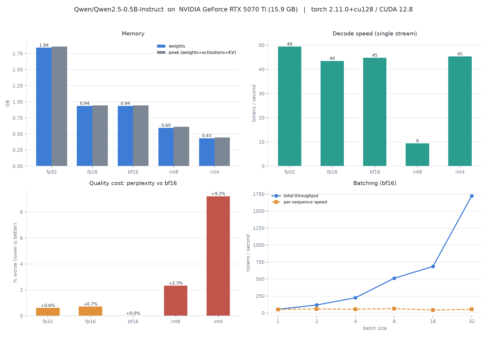

# ⚡ Project 06 — Local GPU Inference: quantisation, batching, and what they cost

Measure what quantisation and batching actually do on one consumer GPU — memory,
latency, throughput **and the quality you pay for them**.

> **In one sentence:** the benchmark refuted the textbook claim I started with,
> and finding out *why* is more useful than the numbers themselves.

---

## 🧠 The idea (for non-experts)

You have a model and a GPU. Three questions decide whether the pairing works:

1. **Does it fit?** — memory
2. **Is it fast enough?** — latency and throughput
3. **Is it still good?** — quality

Almost every "optimisation" trades one for another. **Quantisation** stores
weights in fewer bits (16 → 8 → 4) which shrinks memory and *may* speed things
up, at some cost in accuracy. **Batching** processes several requests in one
forward pass, which massively raises total throughput while slightly slowing any
individual request.

The engineering skill is not knowing that these techniques exist. It's knowing
**which resource you are actually short of**, because optimising the wrong one
costs you time and quality for nothing.

---

## ⚠️ The result that matters most

I wrote the standard claim into the script's docstring before running it:
*single-stream LLM decoding is memory-bandwidth bound — generating a token reads
every weight from VRAM, so a model twice the size decodes twice as slowly.*

Then I measured two model sizes:

| Model | weights (bf16) | decode tok/s |
|---|---:|---:|
| Qwen2.5-**0.5B** | 0.94 GB | **44.8** |
| Qwen2.5-**1.5B** | 2.89 GB | **38.7** |

**Three times the bytes per token. Essentially the same speed.** If decoding were
bandwidth bound, the 1.5B would be ~3× slower. It isn't.

**Why:** at this scale with HuggingFace `generate()`, wall clock is dominated by
**per-token overhead** — the Python loop, kernel launch latency, and 24–28
sequential small matmuls that never come close to saturating the card. The GPU
spends most of each token idle, waiting to be told what to do next.

The bandwidth-bound regime is real. It just starts further out: bigger models
(7B+) and runtimes that strip the overhead (vLLM, TensorRT-LLM, llama.cpp with
CUDA graphs). **Knowing which regime you're in is the actual skill**, because it
determines whether quantising, batching, or changing runtime is the win.

---

## ✅ Full results

RTX 5070 Ti 16 GB, torch 2.11.0+cu128, 128 generated tokens, greedy.

### Qwen2.5-0.5B-Instruct

| variant | load s | weights GB | peak GB | TTFT ms | decode tok/s | perplexity |
|---|---:|---:|---:|---:|---:|---:|
| fp32 | 1.5 | 1.841 | 1.857 | 19 | **49.4** | 65.88 |
| fp16 | 1.1 | 0.937 | 0.942 | 44 | 43.5 | 65.95 |
| bf16 | 1.1 | 0.937 | 0.942 | 19 | 44.8 | **65.48** |
| int8 | 1.7 | 0.597 | 0.612 | 110 | **9.4** | 67.00 |
| int4 | 1.2 | **0.435** | **0.445** | 27 | 45.3 | 71.52 |

### Qwen2.5-1.5B-Instruct

| variant | weights GB | TTFT ms | decode tok/s | perplexity |
|---|---:|---:|---:|---:|
| fp32 | 5.752 | 26 | 42.4 | 43.15 |
| fp16 | 2.885 | 24 | **48.4** | 43.17 |
| bf16 | 2.885 | 22 | 38.7 | **42.88** |
| int8 | 1.671 | 140 | **10.0** | 44.03 |
| int4 | **1.083** | 36 | 43.8 | 49.48 (+15.4%) |



### 🔍 Reading the table

**fp32 is not slower than bf16 here.** On the 0.5B it measured *faster*
(49.4 vs 44.8). In the overhead-bound regime that is possible — fp32 reads twice
the bytes and it doesn't matter. But see the variance section below before
believing the ordering: **that gap is inside the noise floor** and I would not
defend it. What survives is the weaker, robust claim: fp32 is not meaningfully
slower, which is already surprising and already refutes the textbook line.

**int4 buys 2.2× less memory and no speed.** Median over 5 runs: bf16 49.1 vs
int4 47.9 tok/s — a 0.98× ratio, indistinguishable. Use int4 when you need the
model to *fit*, not to make it fast.

### ⚠️ How much do these speed numbers move? Measured — and it changes the reading

Re-running this benchmark months later reproduced **memory and perplexity to the
digit** and **did not reproduce the decode speeds**:

| | documented | re-run | 3 isolated runs |
|---|---:|---:|---|
| bf16 decode (0.5B) | 44.8 | **61.0** | 45.1 / 40.7 / 43.5 |
| int4 decode (0.5B) | 45.3 | 49.3 | 49.8 / 46.7 / 47.0 |
| int4 ÷ bf16 | 1.01× | **0.81×** | **1.10× / 1.15× / 1.08×** |

The *sign* of the int4-vs-bf16 difference flips depending on the run. So the
benchmark now takes `--repeats` (default 3) and reports the **median plus the
spread**:

```
bf16 median 49.1 tok/s  spread 36.6% over 5 runs
int4 median 47.9 tok/s  spread 28.6% over 5 runs
```

**A ~30–37% spread is larger than every difference between fp32, fp16, bf16 and
int4 combined.** Which splits this project's findings cleanly:

| claim | status |
|---|---|
| memory per variant | **exact** across runs — deterministic |
| perplexity per variant (incl. int4 +9.2% / +15.4%) | **exact** across runs — deterministic |
| int8 is ~4–5× slower | **robust** — far outside the noise |
| 3× the weights ≠ 3× slower (0.5B vs 1.5B) | **robust** — bandwidth predicts ~15 tok/s; the 1.5B never dropped below 38.7 |
| batching gives ~29–32× | **robust** — an order of magnitude outside noise |
| "fp32 is the fastest variant" | **not supported** by a single run |
| fine-grained fp16/bf16/int4 ordering | **not supported** by a single run |

The lesson is the one the project already argues, turned on itself: *a number
without an error bar invites over-reading, and I over-read my own.* The headline
conclusion — decoding at this scale is **overhead-bound, not bandwidth-bound** —
is untouched, because it rests on a 3× prediction failing by a factor of two to
three, not on a 10% difference.

**int8 is a trap at this scale — 5× slower.** `LLM.int8()` isn't plain 8-bit
arithmetic: it decomposes each matmul, routes outlier features through a separate
fp16 path, and recombines. That machinery costs far more than the bandwidth it
saves when you weren't bandwidth-bound. The warnings it emits
(`inputs will be cast from bfloat16 to float16`) are the extra work being visible.
It's a technique for fitting large models, not for speed.

**The quality column is the one most benchmarks omit.** int4 costs **+9.2%
perplexity on the 0.5B and +15.4% on the 1.5B**. A memory chart with no quality
chart next to it is an advert, not a measurement. (Caveat: perplexity on one
fixed passage is a crude proxy — good for direction, not for ranking. A real
decision needs task evals like the ones in projects 01, 02 and 04.)

### Batching — the effect that actually dominates

Qwen2.5-0.5B, bf16:

| batch | total tok/s | vs batch 1 | per-seq tok/s | peak GB |
|---:|---:|---:|---:|---:|
| 1 | 53.0 | 1.00× | 53.0 | 0.94 |
| 2 | 116.9 | 2.21× | 58.4 | 0.95 |
| 4 | 223.5 | 4.22× | 55.9 | 0.96 |
| 8 | 510.2 | 9.63× | 63.8 | 0.98 |
| 16 | 683.9 | 12.90× | 42.7 | 1.02 |
| 32 | **1723.0** | **32.51×** | 53.8 | **1.12** |

**32× the throughput for 0.18 GB more memory, and per-sequence speed barely
moves.** The weights are read once per forward pass regardless of batch size, so
in the overhead-bound regime the extra sequences are nearly free — you're
amortising per-token overhead across 32 requests instead of 1.

That gap between the two columns is the entire economic argument for batched
serving, and it's the single most important number here. It's also why vLLM's
continuous batching exists: it keeps the batch full as requests arrive and finish
rather than waiting to assemble one.

(Per-sequence numbers wobble — 42.7 at batch 16 vs 63.8 at batch 8 — because a
single timed run at each size on a desktop GPU has real variance. The total-column
trend is robust; I wouldn't quote the per-sequence values to two significant
figures.)

---

## 📁 What's in this project

```
06_local_gpu_inference/
├── benchmark.py        the harness: 5 precision variants + a batching sweep
├── plot_results.py     4-panel chart from results.json
├── results.json        Qwen2.5-0.5B
├── results_1_5b.json   Qwen2.5-1.5B
├── benchmark.png
└── benchmark_1_5b.png
```

---

## 🚀 How to run it

```powershell
..\activate.ps1

python benchmark.py                                    # 0.5B, all variants
python benchmark.py --model Qwen/Qwen2.5-1.5B-Instruct --out results_1_5b.json
python plot_results.py

python benchmark.py --variants bf16 int4 --skip-quality   # quick
python benchmark.py --batch-sizes 1 4 16 64               # push batching
```

---

## ⚙️ How the measurement is done (and the mistakes it avoids)

| Practice | Why |
|---|---|
| `torch.cuda.synchronize()` around every timed region | CUDA is asynchronous. Without it you time kernel *launches*, not execution, and report numbers ~10× too good. |
| **TTFT measured separately** from decode | Prefill (whole prompt, parallel) and decode (one token at a time) have completely different cost models. A single blended "tokens/sec" hides both. |
| A warmup pass before every measurement | The first call pays CUDA context setup, autotuning and allocator warmup. |
| `reset_peak_memory_stats()` per variant | Otherwise peak memory leaks across variants and every result after the first is wrong. |
| Perplexity on a **fixed** passage | The absolute value is meaningless; the delta between variants is the whole point. |
| `do_sample=False` | Sampling makes runs incomparable. |

---

## 🖥️ Tech stack

- **Models:** `Qwen/Qwen2.5-0.5B-Instruct`, `Qwen/Qwen2.5-1.5B-Instruct`
- **Quantisation:** bitsandbytes — `LLM.int8()` and NF4 with double quantisation
- **Runtime:** HuggingFace `transformers.generate()` (deliberately — see FAQ)
- **Validated on:** RTX 5070 Ti 16 GB (sm_120), torch 2.11.0+cu128, Python 3.12

---

## ❓ FAQ

**Why benchmark HF transformers instead of vLLM?**
Because HF `generate()` is what most people actually run first, and its overhead
is precisely what makes the overhead-bound regime visible. The honest framing is
that these numbers characterise **this runtime** on this hardware. A production
comparison would add vLLM and llama.cpp, and I'd expect the bandwidth story to
reassert itself once the Python loop is gone.

**When *should* I quantise?**
When the model doesn't fit, or when you need VRAM headroom for a bigger batch or
longer KV cache. NF4 is a good default; int8 via LLM.int8() is for fitting large
models, not for speed. Always measure the quality cost on your task, not just
perplexity.

**bf16 or fp16?**
bf16 for **training** — same range as fp32, so no gradient scaler and no silent
inf/NaN. For inference either is fine; here they're within noise of each other,
and bf16 had marginally the best perplexity.

**Why does the KV cache matter and where is it in these numbers?**
It's inside "peak GB", and it's small here because the sequences are short. It
grows as `2 × layers × heads × head_dim × seq_len × batch × bytes` — linear in
both context length and batch size. At long context it becomes the dominant
memory term, not the weights, which is what paged attention (vLLM) and GQA exist
to address.

**Batch 32 was 32× faster. Should I just batch everything?**
Total throughput goes up; **individual request latency eventually goes up too**,
and memory grows with the KV cache. Interactive serving optimises p99 latency,
offline batch jobs optimise throughput, and they land on very different batch
sizes. The right answer is continuous batching, which keeps the batch full
without making any one request wait for a batch to assemble.

**Would these numbers hold on a different GPU?**
The *shape* would; the crossover points wouldn't. A card with less bandwidth
relative to compute enters the bandwidth-bound regime sooner. Re-run it — that's
what the script is for.

---

## Related projects

- **[02_lora_text](../02_lora_text/)** — where the QLoRA VRAM result came from,
  and the same "know which resource you're short of" lesson in a training context
- **[01_rag_local](../01_rag_local/)** — the generation half of that pipeline is
  exactly the workload measured here
